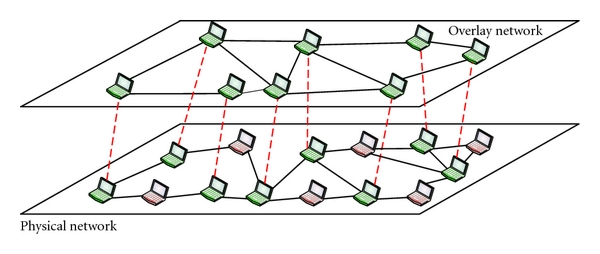
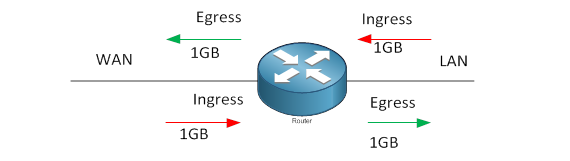

#### overlay driver
* An overlay network is a computer network that is built on top of another network. 
Nodes in the overlay network can be thought of as being connected by virtual or logical links, each of which corresponds to a path, perhaps through many physical links, in the underlying network

* With the overlay driver, multi-host networks are first-class citizens inside Docker without external provisioning or components

* The `overlay` driver utilizes an industry-standard VXLAN data plane that decouples the container network from the underlying physical network (the underlay)
* VXLAN, encapsulates L2 into UDP. Tunneling using L3 means that no specialized hardware is required and such overlay networks could be build purely in software.

and when it comes to docker
* Docker overlay networks are used in the context of docker clusters (Docker Swarm), where a virtual network used by containers needs to span multiple physical hosts running the docker engine  
Swarm scopes overlay networks cannot be used for "docker run", only for services

Let's start by creating a swarm using docker-in-docker
~~~
10-docker-overlay-networking $ chmod +x docker-swarm.sh && ./docker-swarm.sh -w -s
~~~

let's check what we created

~~~
host$ manager docker network ls

NETWORK ID          NAME                DRIVER              SCOPE
fb9152b494ec        bridge              bridge              local
21ce4a33a60d        docker_gwbridge     bridge              local
7e6a5df179a3        host                host                local
c60vezcxgz45        ingress             overlay             swarm
541df91ecff5        none                null                local
~~~

let's check the server service
 
~~~
 
host$ for i in {1..5}; do curl localhost:8000/etc/hostname; echo ; done
{"serverHostName":"a1ad988af922","proxyHostName":"64b044c48309"}
{"serverHostName":"c72f9c46389d","proxyHostName":"a051c9e81e7b"}
{"serverHostName":"c72f9c46389d","proxyHostName":"64b044c48309"}
{"serverHostName":"a1ad988af922","proxyHostName":"a051c9e81e7b"}
{"serverHostName":"a1ad988af922","proxyHostName":"64b044c48309"}
~~~

now, let's see how this magic happens

First let's investigate the ingress load balancing and the routing mesh
It is a new feature in Docker 1.12 that combines ipvs and iptables to create a powerful cluster-wide transport-layer (L4) load balancer
When any Swarm node receives traffic destined to the published TCP/UDP port of a running service, it forwards it to service's VIP using a pre-defined overlay network called ingress

In high level, this is how it goes: 

the interfaces
~~~
host$ manager ip -o -f inet a
      1: lo    inet 127.0.0.1/8 scope host lo\       valid_lft forever preferred_lft forever
      10: docker0    inet 172.17.0.1/16 scope global docker0\       valid_lft forever preferred_lft forever
      15: docker_gwbridge    inet 172.19.0.1/16 scope global docker_gwbridge\       valid_lft forever preferred_lft forever
      45: eth0    inet 172.18.0.2/16 scope global eth0\       valid_lft forever preferred_lft forever
~~~

ingress ? what is ingress ? 

the iptables rules
~~~
host$ manager iptables -t nat -L PREROUTING 1
      DOCKER-INGRESS  all  --  anywhere             anywhere             ADDRTYPE match dst-type LOCAL
      host$ manager iptables -t nat -L DOCKER-INGRESS 1
      DNAT       tcp  --  anywhere             anywhere             tcp dpt:8000 to:172.19.0.2:8000
      host$ proxy iptables -t nat -L DOCKER-INGRESS 1
      DNAT       tcp  --  anywhere             anywhere             tcp dpt:8000 to:172.19.0.2:8000
      host$ server iptables -t nat -L DOCKER-INGRESS 1
      DNAT       tcp  --  anywhere             anywhere             tcp dpt:8000 to:172.19.0.2:8000

~~~

the routing table

~~~
host$ manager ip -o route
      default via 172.18.0.1 dev eth0
      172.17.0.0/16 dev docker0  src 172.17.0.1
      172.18.0.0/16 dev eth0  src 172.18.0.2
      172.19.0.0/16 dev docker_gwbridge  src 172.19.0.1
~~~

let's monitor the traffic coming from our host to the eth0 of the manager

`manager tcpdump ip and not port 7946 and not port 2377  -i eth0  -n --immediate-mode`

lets curl our service

`curl localhost:8000/etc/hostname`

|   | Namespace            | docker network  | interface       | address    |
|:-:|----------------------|-----------------|-----------------|------------|
| 1 | docker-for-mac       | nethandson      | br-             | 172.18.0.1 |
| 2 | manager              | mynet           | eth0            | 172.18.0.2 |
| 3 | manager              | mynet           | docker_gwbridge | 172.19.0.1 |
| 4 | manager ingress-sbox | mynet           | eth1            | 172.19.0.2 |
| 5 | manager ingress-sbox | mynet           | eth0            | 10.255.0.2 |

what do we expect ?
 
you can monitor traffic using the following : 

| namespace            | interface       | tcpdump command                                                                                                                                      |
|----------------------|-----------------|------------------------------------------------------------------------------------------------------------------------------------------------------|
| manager              | eth0            | manager tcpdump ip and port 8000 and '(((ip[2:2] - ((ip[0]&0xf)>2)) != 0)' -i eth0,--immediate-mode                                                  |
| manager              | docker_gwbridge | manager tcpdump ip and port 8000 and '(((ip[2:2] - ((ip[0]&0xf)>2)) != 0)' -i docker_gwbridge --immediate-mode                                       |
| manager ingress_sbox | eth1            | manager nsenter --net=/var/run/docker/netns/ingress_sbox tcpdump ip and port 8000 and '(((ip[2:2] - ((ip[0]&0xf)>2)) != 0)' -i eth1 --immediate-mode |
| manager ingress_sbox | eth0            | manager nsenter --net=/var/run/docker/netns/ingress_sbox tcpdump ip and port 8000 and '(((ip[2:2] - ((ip[0]&0xf)>2)) != 0)' -i eth0,--immediate-mode |

 
 
 172.18.0.1
 

`172.18.0.1.39946 > 172.18.0.2.8000` - this is our user defined docker bridge (nethandson) forwarding to eth0 of the manager `host`

how is it routed to  `172.18.0.2` ? 

~~~
host$ manager ip r
default via 172.18.0.1 dev eth0
172.17.0.0/16 dev docker0  src 172.17.0.1
172.18.0.0/16 dev eth0  src 172.18.0.2
172.19.0.0/16 dev docker_gwbridge  src 172.19.0.1
~~~
it is the docker_gwbridge interface

now, let's check what's happening inside the docker-ingress namespace 

* each service gets a VIP 

~~~
host$ manager docker service inspect --format '{{.Spec.Name}}-{{json .Endpoint.VirtualIPs}}' $(manager docker service ls -q)
      server-[{"NetworkID":"ddxnkhz3tzaq2ce7sul7qofyk","Addr":"10.0.0.2/24"}]
      proxy-[{"NetworkID":"20408srk3176a0yeyjxdxkh28","Addr":"10.255.0.6/16"},{"NetworkID":"ddxnkhz3tzaq2ce7sul7qofyk","Addr":"10.0.0.5/24"}]
~~~

The service is given a Virtual IP address that is routable only inside the Docker Network. 
When requests are made to the IP address, they are distributed to the underlying containers. 
This Virtual IP is registered with the Embedded DNS server in Docker. 
When a DNS lookup is made based on the service name, the Virtual IP is returned.
DNS server is embedded inside Docker engine. Docker DNS resolves the service name and returns list of container ip addresses in random order. 
Clients normally will pick the first IP so that load balancing can happen between the different instance of the servers.

let's see this in action by monitoring networking on all nodes and containers .. 

the server node
~~~
host$ server docker run --rm --net=container:$(server docker ps  -l -q) crccheck/tcpdump not port 7946 and not port 2377 -i any --immediate-mode
# not port - filter out swarm communication among nodes (7946) and cluster management communications (2377)
# -i any - all interfaces
# --immediate-mode - don't buffer output. 
~~~

service discovery 

load balancing

ingress load balancing

The mynet (overlay) network - The ingress and egress point to the overlay network that VXLAN encapsulates and (optionally) encrypts traffic going between containers on the same overlay network

#### links
* http://www.slideshare.net/Docker/docker-networking-deep-dive  
* http://www.slideshare.net/Docker/docker-networking-control-plane-and-data-plane  
* [Docker Networking: Control Plane and Data Plane](https://www.youtube.com/watch?v=2EfOJhtjhIk)  
* [Docker Meetup #42](https://www.youtube.com/watch?v=2ihqKMDRkxM)  
* http://securitynik.blogspot.co.il/2016/12/docker-networking-internals-container.html  
* [tcpdump usage](http://www.tcpdump.org/tcpdump_man.html)

 is the routing mash network, it is the only network created on all nodes.
* dns service is running inside the daemon. 
* the net1 network will be created on demand.
* docker_gwbridge is used as a gateway to the outer world

TCP port 2377 for cluster management communications.
TCP and UDP port 7946 for communication among nodes.
TCP and UDP port 4789 for overlay network traffic, (vxlan uses udp port 4789):
