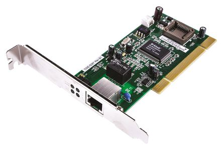

### nic 
* A network interface is the point of interconnection between a computer and a private or public network. 
* A network interface is generally a network interface card (NIC), but does not have to have a physical form.
* Instead, the network interface can be implemented in software. 
* For example, the loopback interface (127.0.0.1 for IPv4 and ::1 for IPv6) is not a physical device but a piece of software simulating a network interface

~~~

host $ docker run --rm -it --privileged --name c1 odedpriva/docker-networking sh
c1 $ ip link add name dummy1 type dummy
c1 $ ip l set dummy1 up
c1 $ ip addr add 127.0.0.2/8 dev dummy1
c1 $ ping -c 2 127.0.0.2
     PING 127.0.0.2 (127.0.0.2): 56 data bytes
     64 bytes from 127.0.0.2: seq=0 ttl=64 time=0.094 ms
     64 bytes from 127.0.0.2: seq=1 ttl=64 time=0.066 ms
     
     --- 127.0.0.2 ping statistics ---
     2 packets transmitted, 2 packets received, 0% packet loss
     round-trip min/avg/max = 0.066/0.080/0.094 ms

~~~

*ip* - show / manipulate routing, devices, policy routing and tunnels
it is available when installing iproute2 package

*ping* - The ping command operates by sending `Internet Control Message Protocol` (ICMP) Echo Request messages to the destination computer and waiting for a response.

### links 

* https://docs.oracle.com/javase/tutorial/networking/nifs/definition.html
* http://www.policyrouting.org/iproute2.doc.html

